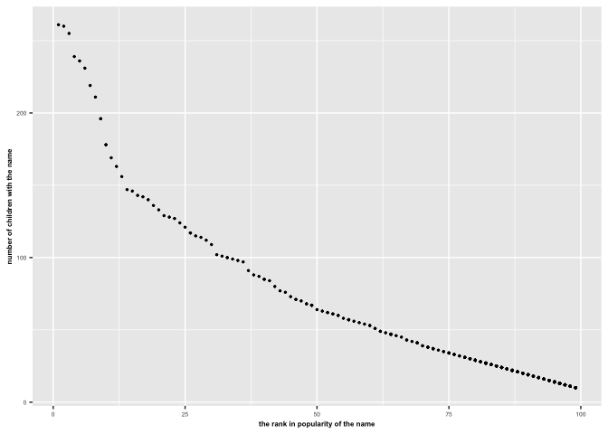

p8105\_hw2\_ac4964
================
AnMei Chen
10/1/2021

``` r
library(tidyverse)
```

    ## ── Attaching packages ─────────────────────────────────────── tidyverse 1.3.1 ──

    ## ✓ ggplot2 3.3.5     ✓ purrr   0.3.4
    ## ✓ tibble  3.1.4     ✓ dplyr   1.0.7
    ## ✓ tidyr   1.1.3     ✓ stringr 1.4.0
    ## ✓ readr   2.0.1     ✓ forcats 0.5.1

    ## ── Conflicts ────────────────────────────────────────── tidyverse_conflicts() ──
    ## x dplyr::filter() masks stats::filter()
    ## x dplyr::lag()    masks stats::lag()

``` r
library(readxl)
library(dplyr)
library(ggplot2)
```

# Problem 1

Read and clean the Mr.Trash Wheel sheet

``` r
Mr_trash_df = 
  read_excel("data/Trash-Wheel-Collection-Totals-8-6-19.xlsx",sheet = "Mr. Trash Wheel", range = "A2:N406") %>% 
  janitor::clean_names() %>% 
  drop_na(dumpster) %>% 
  mutate(
    sports_balls = round(sports_balls,digits = 0)
  )
```

Read and clean precipitation data for 2018 and 2019

``` r
Precipitation_2018_df = 
  read_excel("data/Trash-Wheel-Collection-Totals-8-6-19.xlsx",sheet = "2018 Precipitation", range = "A2:B14") %>% 
  janitor::clean_names() %>% 
  mutate(year = "2018") %>% 
  relocate(year)

Precipitation_2019_df = 
  read_excel("data/Trash-Wheel-Collection-Totals-8-6-19.xlsx",sheet = "2019 Precipitation", range = "A2:B14") %>% 
  janitor::clean_names() %>% 
  mutate(year = "2019") %>% 
  relocate(year)
```

Combine 2018 and 2019 precipitation datasets

``` r
Precipitations_df = 
  bind_rows(Precipitation_2018_df,Precipitation_2019_df) %>% 
  mutate( month = month.name[month])
```

Write a paragraph about the Mr.Trash Wheel dataset:

The dataset of Mr.Trash Wheel (Mr.Trash\_df) contains data of the
trashes collected by Mr. Trash Wheel from 2014 to 2019. It contains a
total of 344 observations and 14 variables (dumpster, month, year, date,
weight\_tons, volume\_cubic\_yards, plastic\_bottles, polystyrene,
cigarette\_butts, glass\_bottles, grocery\_bags, chip\_bags,
sports\_balls, homes\_powered). It has collected a total of 1122.45 tons
and 5347 cubic yards of trashes. The median number of sports balls in a
dumpster in 2017 is 8.

``` r
# To find the median number of sports balls in a dumpster in 2017

get_2017_df = filter(Mr_trash_df, year == 2017)
pull_sports_balls = pull(get_2017_df,sports_balls)
median(pull_sports_balls)
```

    ## [1] 8

Write a paragraph for the combined precipitation data set:

The dataset of 2018 and 2019 precipitation contains data of the
precipitations collected from 2018 to 2019, with the maximum
precipitation of 10.47 and minimum precipitation of 0.42. It contains a
total of 24 observations and 3 variables (year, month, total). The total
precipitation in 2018 is 87.

# Problem 2

Read and clean the data in pols-month.csv

``` r
pols_month_df = 
  read_csv("data/fivethirtyeight_datasets/pols-month.csv") %>% 
  janitor::clean_names() %>% 
  separate(mon, into = c("year", "month","day"), sep = "-",convert = TRUE) %>% 
  mutate( 
    month = month.name[month],
    ) %>% 
  mutate(president = recode(prez_gop, `0` = "dem", `1` = "gop")) %>% 
  select(c(-prez_gop,-prez_dem,-day))
```

    ## Warning: Unreplaced values treated as NA as .x is not compatible. Please specify
    ## replacements exhaustively or supply .default

read and clean data in snp.csv

``` r
snp_df = 
  read_csv("data/fivethirtyeight_datasets/snp.csv") %>% 
  janitor::clean_names() %>% 
  mutate(date = lubridate::mdy(date)) %>% 
  separate(date, into = c("year","month","day"), sep = "-",convert = TRUE) %>% 
  mutate(year = ifelse(year > 2021, year - 100, year)) %>% 
  arrange(year, month) %>%
  mutate(month = month.name[month]) %>% 
  relocate(year)  
```

Read and clean the unemployment data

``` r
unemploy_df = 
  read_csv("data/fivethirtyeight_datasets/unemployment.csv") %>% 
  janitor::clean_names() %>%
  mutate(year = as.integer(year)) %>% 
  pivot_longer(
    jan:dec,
    names_to = "month",
    values_to = "unemployment") %>% 
  mutate(month = recode(month, "jan" = "January", "feb" = "February", "mar" = "March", "apr" = "April", "may" = "May", "jun" = "June", "jul" = "July", "aug" = "August", "sep" = "September", "oct" = "October", "nov" = "November", "dec" = "December"))
```

Merge snp into pols, and merging unemployment into the result

``` r
snp_into_pols_df = left_join(pols_month_df, snp_df,by = c("year","month")) 

snp_pols_unemploy_df = left_join(snp_into_pols_df, unemploy_df, by = c("year","month"))
```

Write a paragraph about these datasets

The dataset of `pols_months_df` contains data collected from 1947 to
2015. It contains a total of 822 observations and 9 variables (year,
month, gov\_gop, sen\_gop, rep\_gop, gov\_dem, sen\_dem, rep\_dem,
president). The dataset of `snp_df` contains data collected from 1950 to
2015. It contains a total of 787 observations and 4 variables (year,
month, day, close). The dataset of `unemployment_df` contains data
collected from 1948 to 2015. It contains a total of 816 observations and
3 variables (year, month, unemployment).

After merging all three datasets, the resulting dataset
`snp_pols_unemploy_df` contains data collected from 1947 to 2015. It
contains a total of 822 observations and 12 variables (year, month,
gov\_gop, sen\_gop, rep\_gop, gov\_dem, sen\_dem, rep\_dem, president,
day, close, unemployment).

# Problem 3

Read and load Popular baby names data

``` r
baby_names_df =
  read_csv("./data/Popular_Baby_Names.csv") %>% 
  janitor::clean_names() %>% 
  mutate(
    gender = str_to_title(gender),
    ethnicity = str_to_title(ethnicity),
    childs_first_name = str_to_title(childs_first_name),
    ethnicity = recode(ethnicity, "Asian And Paci" = "Asian And Pacific Islander", "Black Non Hisp" = "Black Non Hispanic", "White Non Hisp" = "White Non Hispanic")
    ) %>% 
  distinct()
```

    ## Rows: 19418 Columns: 6

    ## ── Column specification ────────────────────────────────────────────────────────
    ## Delimiter: ","
    ## chr (3): Gender, Ethnicity, Child's First Name
    ## dbl (3): Year of Birth, Count, Rank

    ## 
    ## ℹ Use `spec()` to retrieve the full column specification for this data.
    ## ℹ Specify the column types or set `show_col_types = FALSE` to quiet this message.

Produce a reader-friendly table showing the rank in the popularity of
the name “Olivia” as a female baby name over time.

``` r
Olivia_rank_df = 
  filter(baby_names_df, childs_first_name == "Olivia", gender == "Female") %>% 
  arrange(year_of_birth,rank)

Olivia_rank = 
  Olivia_rank_df %>% 
  select(c(-gender,-childs_first_name,-count)) %>% 
  pivot_wider(
    names_from = "year_of_birth",
    values_from = "rank"
    ) %>% 
  arrange(ethnicity) %>% 
  knitr::kable() 
```

Produce a table showinh the most popular name among male children over
time

``` r
male_rank_df = 
  filter(baby_names_df, gender == "Male", rank == "1") %>%
  arrange(year_of_birth,rank)

male_rank = 
  male_rank_df %>% 
  select(c(-gender,-count)) %>% 
  pivot_wider(
    names_from = "year_of_birth",
    values_from = "rank",
  ) %>% 
  relocate(childs_first_name) %>% 
  arrange(childs_first_name) %>% 
  knitr::kable() 
```

Produce a scatter plot for male, white non-Hispanic children born in
2016.

``` r
wnh_male_rank_df = filter(baby_names_df, gender == "Male", ethnicity == "White Non Hispanic", year_of_birth == "2016") 

wnh_male_rank_plot <- ggplot(wnh_male_rank_df, aes(x = rank , y = count)) + geom_point(size = 0.5) + 
  theme(axis.text = element_text(size = 5), axis.title = element_text(size = 6,face = "bold")) +
  ylab("number of children with the name") + 
  xlab("the rank in popularity of the name")

wnh_male_rank_plot
```

<!-- -->
